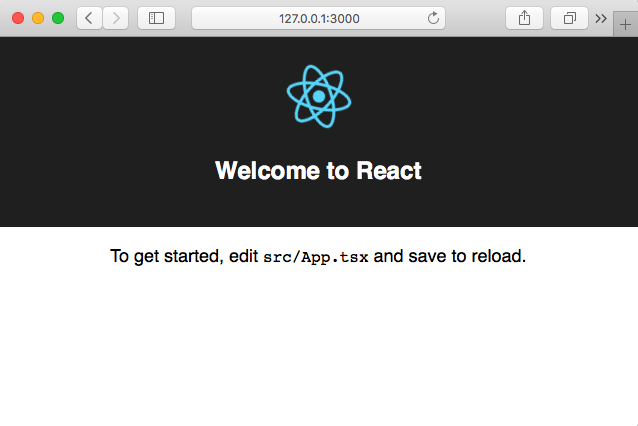
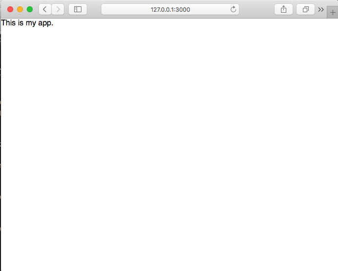

Lab 5
=====

Introduction to ReactJS
-----------------------

This repo is a very slightly modified form of the Lab-05 repository. I've
simply added a small user interaction to explain one way to handle "state"
in a trivial React context. The only modified files are `src/App.tsx` and 
`src/App.css`. There is a button that simply toggles a class between two
css classes that defined a green or red background color.

You can run the image using:

docker run --rm -it -v "$PWD":/work -v /work/node_modules -p 3000:3000 asmt05 sh

Once the container is running, type:

        yarn start
        
to launch the web app. From the container window you should see something like:

        Compiled successfully!

        You can now view lab5 in the browser.

          Local:            http://localhost:3000/
          On Your Network:  http://172.17.0.2:3000/

        Note that the development build is not optimized.
        To create a production build, use yarn build.

You can view the web app in your browser by navigating to one of the URLs suggested, or 
if you are using docker-toolbox or docker-machine you may need to visit the machine
IP displayed when you started your docker session. See below for an example
of a docker-machine/toolbox starting up on 192.168.99.100. In this case the developer
would navigate to: "http://192.168.99.100:3000" :

                                ##         .
                          ## ## ##        ==
                       ## ## ## ## ##    ===
                   /"""""""""""""""""\___/ ===
              ~~~ {~~ ~~~~ ~~~ ~~~~ ~~~ ~ /  ===- ~~~
                   \______ o           __/
                     \    \         __/
                      \____\_______/

        docker is configured to use the default machine with IP 192.168.99.100
        For help getting started, check out the docs at https://docs.docker.com

        Start interactive shell

You should see the demo starter app, that looks like this:

First let's simplify! The lab5 repository is exactly what you get after running "create-react-app". 
We can eliminate the demo app and start simple. Edit "src/App.tsx" so it looks like this:

        import * as React from 'react';
        import './App.css';

        class App extends React.Component {
        public render() {
            return (
                
This is my app.

            );
        }
        }

        export default App;

Then the web display should change to:

Exercise 1: Play around!
------------------------

Pick some HTML you want to test and replace the `
` with anything (simple0 you like. Get a feel for the effect of modifying the html code at this level. Create a markdown document in your repository describing the html you end up with as well as a screen grab of the result.

Exercise 2: Refactor the display of a list of names
----------------------------------------------------

Next, let's display a list of names. Replace the html in the App class with a tabular display like this:

        <table>
            <thead>
                <tr><th>Number</th><th>Name</th></tr>
            </thead>
            <tbody>
                <tr><td>0</td><td>Amy</td></tr>
                <tr><td>1</td><td>Joe</td></tr>
                <tr><td>2</td><td>Sam</td></tr>
                <tr><td>3</td><td>Fred</td></tr>
                <tr><td>4</td><td>Julie</td></tr>
            </tbody>
        </table>

Play around a bit until you understand what the pieces do.

After reviewing "Thinking in React", how might you break this display into a logical hierarchy using React components? Create a UML class diagram that describes this hierarchy.

Exercise 3: Do it! 
------------------

Write a set of React Components that logically distributes the job of presenting the components of this table. Be sure to break out the data into a separate array (similar to the "Thinking in React" example).

